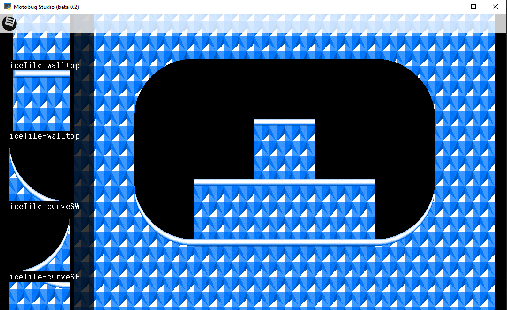

# motobug-engine-designer
Python-based level designer for the [motobug engine](https://github.com/coderman64/motobug-engine).

It is currently deep in beta. It hasn't yet come to implement all possible features from the engine.

Right now, I'm working more on the interface; the actual exporting functionality may come later.



## How do I get it running?

1. Install python 3.8.x
2. Install pysdl2:
```
py -m pip install pysdl2 pysdl2-dlls
```

3. run main.py:

```
py main.py
```


