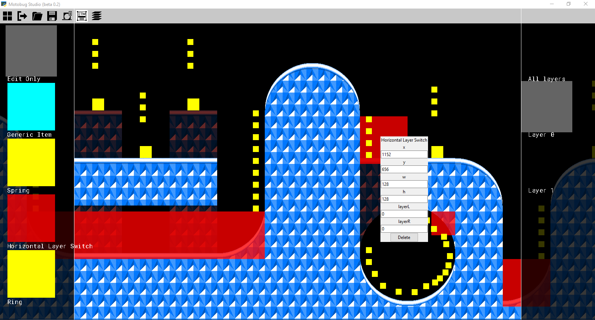

# motobug-engine-designer
Python-based level designer for the [motobug engine](https://github.com/coderman64/motobug-engine), which was also created by me.

It is currently deep in beta. It hasn't yet come to implement all possible features from the engine.

Right now, I'm working more on the interface; the actual exporting functionality may come later.

Current features:
* can read motobug tileset scan files
* can open project files (".mbproj")
* can save levels (acts) in projects (".mblvl")
* supports multiple layers
* can export to a .js file (readable by the motobug engine)

### Screenshots:

^ Item editing system (Current screenshot)


^ Tile layering system (Old screenshot)


^ Tile editing system (Old screenshot)

## How do I get it running?

1. Install python 3.8.x
2. Install pysdl2:
```
py -m pip install pysdl2 pysdl2-dll
```

3. run main.py:

```
py main.py
```


